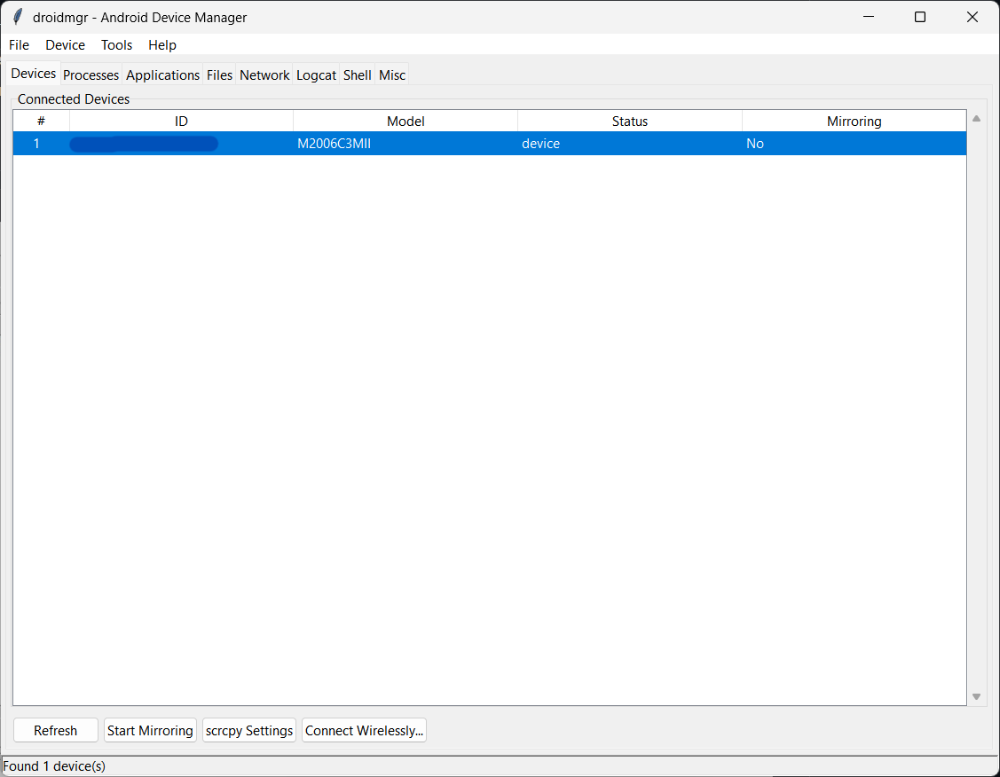
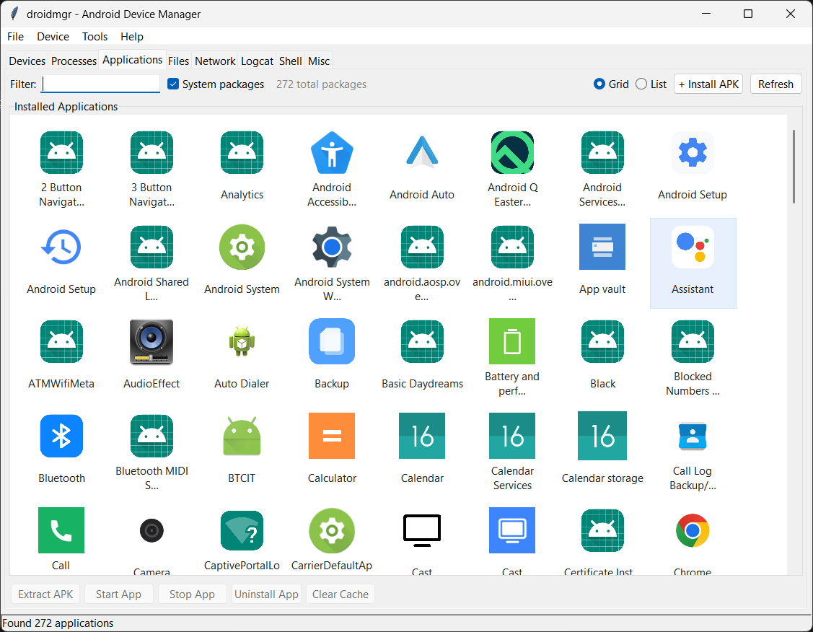
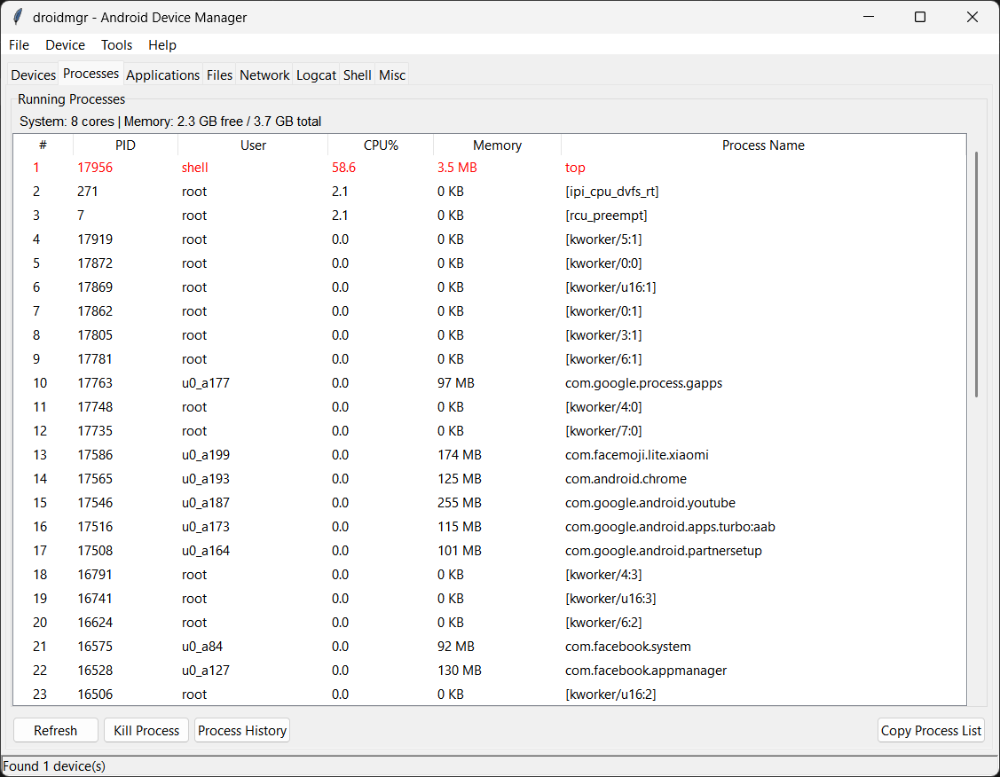
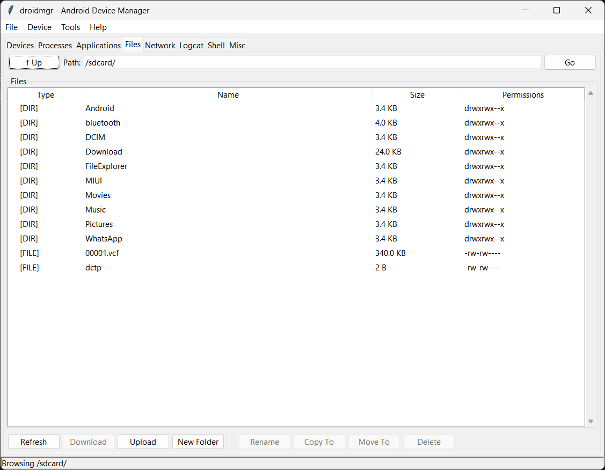

# droidmgr

A GUI frontend for scrcpy and device manager for Android written in Python using tkinter.

> **NOTE:** This is non-production software. Please be aware of potential stability issues. For the safety of your data, I recommend you to use this with an Android emulator or a secondary/testing device.

## Features

- **Device Management**: List and manage all connected Android devices
- **Screen Mirroring**: Start/stop screen mirroring using scrcpy
- **Process Management**: View and kill running processes on devices
- **App Management**: List, start, and stop installed applications
- **File Management**: Browse, download, upload, and delete files on devices
- **Auto-Setup**: Automatically downloads and installs ADB if not found

## Screenshots










## Installation

### Prerequisites

1. **Python 3.8+** with **Tkinter**:
   - **Windows / macOS**: Included with standard official Python installers (ensure "tcl/tk and IDLE" is checked during Windows setup).
   - **Linux (Ubuntu/Debian)**: `sudo apt install python3-tk`
   - **Linux (Fedora)**: `sudo dnf install python3-tkinter`
   - **Linux (Arch)**: `sudo pacman -S tk`

2. **Python Dependencies**:
   - **Pillow** (Recommended): Enables high-fidelity app icon extraction, adaptive icon compositing, WebP decoding, and icon scaling.
     ```bash
     pip install -r requirements.txt
     ```
     *(or `pip install Pillow`)*

3. **scrcpy & ADB**:
   - `droidmgr` can **automatically download and configure ADB and scrcpy** into `~/.droidmgr/bin` if they are not detected in your `PATH`.
   - Alternatively, install them manually:
     - **Linux**: `sudo apt install scrcpy adb`
     - **macOS**: `brew install scrcpy android-platform-tools`
     - **Windows**: Download from [scrcpy releases](https://github.com/Genymobile/scrcpy/releases) and [Android SDK Platform-Tools](https://developer.android.com/tools/releases/platform-tools).

### Running

```bash
# On Linux / macOS:
python3 droidmgr.py

# On Windows:
python droidmgr.py
```

Or make it executable (Linux / macOS):

```bash
chmod +x droidmgr.py
./droidmgr.py
```

## Usage

1. **Connect your Android device** via USB or WiFi ADB
2. **Enable USB debugging** in Developer Options on your device
3. **Run droidmgr**: `python3 droidmgr.py`
4. **Select a device** from the Devices tab
5. **Use the tabs** to manage processes, apps, or files
6. **Click "Start Mirroring"** to begin screen mirroring

## License

Licensed under the [Mozilla Public License 2.0](https://www.mozilla.org/en-US/MPL/2.0/). See [LICENSE](LICENSE) file for details.
